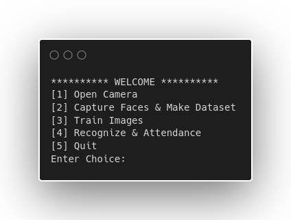

# Real Time Attendence System

#### A real time face recognition attendence marker based on CNN

## 1. Prerequisites

- opencv & opencv-contrib
- pandas
- numpy
- augmentor
- tensorflow
- pillow
- keras
- csv
- shutils
- imutils

## 2. Run

run `main.py`

```sh
python main.py
```

Select what you want to do :



### 2.1. What will happen when you enter a choice

- #### Choice 1

  Open a camera instance to check your camera if it's working or what camera is selected if you have multiple camera connected

- #### Choice 2

  Start face capturing from the active camera and store them in temporal directory then apply **Data Augmentation** technics on captured faces then put the results on `dataset` directory and remove temporal directory

- #### Choice 3

  Train the **CNN model** on the images collected on `dataset` directory and save on `trainedModel` directory as `trained_model.h5`

- #### Choice 4

  Start **Real-Time** multi **face-recognition** and record the present persons, after stoping the system will extarct the absent persons from a pre-given list and save same info and pack everything on `attendence` directory as `.csv` as `{date-of-today}.csv`

  [see more](./attendence/important.md) about Attendence

- #### Choice 5
  Exit the program

**note** : a simple camera window will be shown when interacting with camera-related choices

## 3. Features on-mind

- Location-based and time-based student list selector
- GUI

## 5. To be Achieved

- High Accuracy

## 4. More?

contact

1. yacinesha@gmail.com
2. devmoussac93@gmail.com
